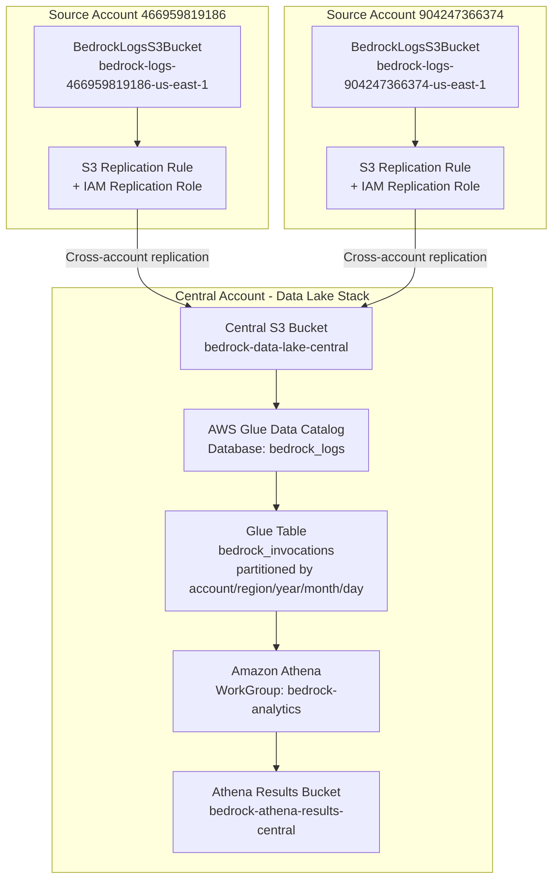
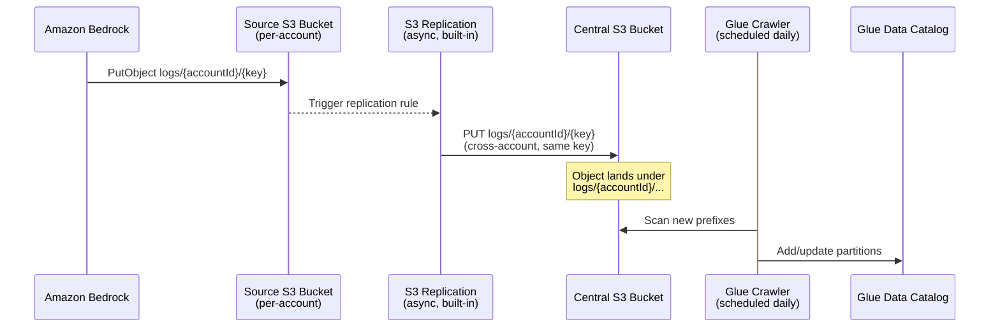
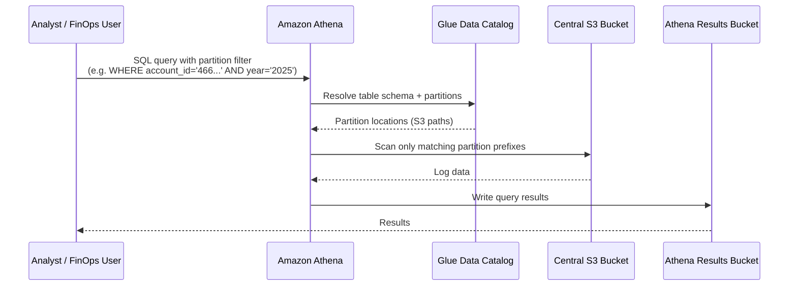

# Design Document: Bedrock Logging Data Lake

## Overview

This feature builds a centralized data lake in a single AWS account that aggregates Bedrock model invocation logs from multiple source accounts via S3 cross-account replication. A partitioned S3 structure and an Athena query layer on top allow teams to run ad-hoc SQL queries across all accounts and regions without moving data manually.

The design covers two artifacts: (1) a new `bedrock-data-lake.yaml` CloudFormation template for the central account, and (2) the modifications required to the existing `bedrock-logging.yaml` template deployed in each source account to enable S3 replication to the central bucket.

---

## Architecture



### Partition Layout

Bedrock writes logs under the path `{accountId}/...`. S3 replication preserves this prefix. The central bucket organises data with additional Hive-compatible partition prefixes so Athena can prune efficiently:

```
s3://bedrock-data-lake-central/
  logs/
    account_id=466959819186/
      region=us-east-1/
        year=2025/
          month=06/
            day=26/
              <log-object>.json.gz
    account_id=904247366374/
      region=us-east-1/
        year=2025/
          month=06/
            day=26/
              <log-object>.json.gz
```

> **Key design decision**: Bedrock writes objects to `{accountId}/{timestamp-prefixed-key}`. A replication prefix filter plus an S3 Object Lambda or a daily Glue ETL job normalises the keys into the Hive partition layout above. The simpler approach (chosen here) is to use a **Glue Crawler** that infers partitions from the raw path and an **`account_id` virtual column** derived from the object key — avoiding any key transformation pipeline.

---

## Sequence Diagrams

### Log Ingestion Flow (Source → Central)



### Query Flow



---

## Components and Interfaces

### Component 1: Central S3 Bucket (`BedrockDataLakeBucket`)

**Purpose**: Single landing zone for replicated Bedrock logs from all source accounts.

**Interface** (CloudFormation resource properties):
```yaml
BedrockDataLakeBucket:
  Type: AWS::S3::Bucket
  Properties:
    BucketName: !Sub 'bedrock-data-lake-${AWS::AccountId}'
    VersioningConfiguration:
      Status: Enabled          # required for S3 replication destination
    BucketEncryption:
      ServerSideEncryptionConfiguration:
        - ServerSideEncryptionByDefault:
            SSEAlgorithm: AES256
    PublicAccessBlockConfiguration:
      BlockPublicAcls: true
      BlockPublicPolicy: true
      IgnorePublicAcls: true
      RestrictPublicBuckets: true
    LifecycleConfiguration:
      Rules:
        - Id: TransitionToIA
          Status: Enabled
          Transitions:
            - TransitionInDays: 90
              StorageClass: STANDARD_IA
            - TransitionInDays: 365
              StorageClass: GLACIER
```

**Responsibilities**:
- Accept `s3:ReplicateObject` actions from source account replication IAM roles
- Preserve object key paths so partition inference works correctly
- Apply server-side encryption to all replicated objects

**Bucket Policy additions required**:
- Allow `s3:ReplicateObject`, `s3:ReplicateDelete`, `s3:ReplicateTags` from each source account's replication role ARN
- Allow `s3:GetBucketVersioning`, `s3:GetObject`, `s3:PutObject` to the replication role

---

### Component 2: Athena Results Bucket (`BedrockAthenaResultsBucket`)

**Purpose**: Stores Athena query output; kept separate from the data lake bucket for cost and access-control clarity.

**Interface**:
```yaml
BedrockAthenaResultsBucket:
  Type: AWS::S3::Bucket
  Properties:
    BucketName: !Sub 'bedrock-athena-results-${AWS::AccountId}'
    BucketEncryption:
      ServerSideEncryptionConfiguration:
        - ServerSideEncryptionByDefault:
            SSEAlgorithm: AES256
    PublicAccessBlockConfiguration:
      BlockPublicAcls: true
      BlockPublicPolicy: true
      IgnorePublicAcls: true
      RestrictPublicBuckets: true
    LifecycleConfiguration:
      Rules:
        - Id: ExpireResults
          Status: Enabled
          ExpirationInDays: 30
```

---

### Component 3: Glue Database and Table (`BedrockLogsGlueDatabase`, `BedrockLogsGlueTable`)

**Purpose**: Provides the schema and partition metadata that Athena uses to query the data lake.

**Interface**:
```yaml
BedrockLogsGlueDatabase:
  Type: AWS::Glue::Database
  Properties:
    DatabaseInput:
      Name: bedrock_logs
      Description: Bedrock model invocation logs from all source accounts

BedrockLogsGlueTable:
  Type: AWS::Glue::Table
  Properties:
    DatabaseName: !Ref BedrockLogsGlueDatabase
    TableInput:
      Name: bedrock_invocations
      TableType: EXTERNAL_TABLE
      PartitionKeys:
        - Name: account_id
          Type: string
        - Name: region
          Type: string
        - Name: year
          Type: string
        - Name: month
          Type: string
        - Name: day
          Type: string
      StorageDescriptor:
        Location: !Sub 's3://bedrock-data-lake-${AWS::AccountId}/logs/'
        InputFormat: org.apache.hadoop.mapred.TextInputFormat
        OutputFormat: org.apache.hadoop.hive.ql.io.HiveIgnoreKeyTextOutputFormat
        SerdeInfo:
          SerializationLibrary: org.openx.data.jsonserde.JsonSerDe
        Columns:
          - Name: schematype
            Type: string
          - Name: schemaversionstr
            Type: string
          - Name: timestamp
            Type: string
          - Name: accountid
            Type: string
          - Name: region
            Type: string
          - Name: requestid
            Type: string
          - Name: operation
            Type: string
          - Name: modelid
            Type: string
          - Name: input
            Type: struct<inputbodyjson:string,inputcontenttype:string,inputtokens:int>
          - Name: output
            Type: struct<outputbodyjson:string,outputcontenttype:string,outputtokens:int>
```

**Responsibilities**:
- Define the authoritative schema for Bedrock invocation log JSON
- Declare Hive-compatible partition keys (`account_id`, `region`, `year`, `month`, `day`)
- Point Athena to the correct S3 prefix

---

### Component 4: Glue Crawler (`BedrockLogsGlueCrawler`)

**Purpose**: Discovers new partition prefixes in the central bucket daily and updates the Glue catalog so Athena can query new data without manual `MSCK REPAIR TABLE`.

**Interface**:
```yaml
BedrockLogsGlueCrawler:
  Type: AWS::Glue::Crawler
  Properties:
    Name: bedrock-logs-crawler
    Role: !GetAtt GlueCrawlerRole.Arn
    DatabaseName: !Ref BedrockLogsGlueDatabase
    Targets:
      S3Targets:
        - Path: !Sub 's3://bedrock-data-lake-${AWS::AccountId}/logs/'
    Schedule:
      ScheduleExpression: 'cron(0 6 * * ? *)'   # Daily at 06:00 UTC
    SchemaChangePolicy:
      UpdateBehavior: UPDATE_IN_DATABASE
      DeleteBehavior: LOG
```

---

### Component 5: Athena WorkGroup (`BedrockAthenaWorkGroup`)

**Purpose**: Enforces query result location, limits per-query data scanned, and enables CloudWatch metrics for cost tracking.

**Interface**:
```yaml
BedrockAthenaWorkGroup:
  Type: AWS::Athena::WorkGroup
  Properties:
    Name: bedrock-analytics
    WorkGroupConfiguration:
      ResultConfiguration:
        OutputLocation: !Sub 's3://bedrock-athena-results-${AWS::AccountId}/results/'
        EncryptionConfiguration:
          EncryptionOption: SSE_S3
      EnforceWorkGroupConfiguration: true
      PublishCloudWatchMetricsEnabled: true
      BytesScannedCutoffPerQuery: 10737418240   # 10 GB safety limit
```

---

### Component 6: Source Account Replication IAM Role (`BedrockS3ReplicationRole`)

**Purpose** (deployed in each **source** account via `bedrock-logging.yaml` modification): Allows S3 to replicate objects from the source bucket to the central account bucket.

**Interface** (added to `bedrock-logging.yaml`):
```yaml
BedrockS3ReplicationRole:
  Type: AWS::IAM::Role
  Properties:
    RoleName: bedrock-s3-replication-role
    AssumeRolePolicyDocument:
      Version: '2012-10-17'
      Statement:
        - Effect: Allow
          Principal:
            Service: s3.amazonaws.com
          Action: sts:AssumeRole
    Policies:
      - PolicyName: BedrockS3ReplicationPolicy
        PolicyDocument:
          Version: '2012-10-17'
          Statement:
            - Sid: SourceBucketRead
              Effect: Allow
              Action:
                - s3:GetReplicationConfiguration
                - s3:ListBucket
              Resource: !GetAtt BedrockLogsS3Bucket.Arn
            - Sid: SourceObjectRead
              Effect: Allow
              Action:
                - s3:GetObjectVersionForReplication
                - s3:GetObjectVersionAcl
                - s3:GetObjectVersionTagging
              Resource: !Sub '${BedrockLogsS3Bucket.Arn}/*'
            - Sid: DestinationWrite
              Effect: Allow
              Action:
                - s3:ReplicateObject
                - s3:ReplicateDelete
                - s3:ReplicateTags
              Resource: !Sub 'arn:aws:s3:::bedrock-data-lake-CENTRAL_ACCOUNT_ID/*'
```

---

## Data Models

### Bedrock Invocation Log Record (JSON on S3)

This is the native structure emitted by Bedrock to S3 as described in the AWS documentation.

```json
{
  "schemaType": "ModelInvocationLog",
  "schemaVersion": "1.0",
  "timestamp": "2025-06-26T12:00:00Z",
  "accountId": "466959819186",
  "region": "us-east-1",
  "requestId": "abc-123",
  "operation": "InvokeModel",
  "modelId": "arn:aws:bedrock:us-east-1:466959819186:application-inference-profile/xyz",
  "input": {
    "inputBodyJson": "{...}",
    "inputContentType": "application/json",
    "inputTokenCount": 512
  },
  "output": {
    "outputBodyJson": "{...}",
    "outputContentType": "application/json",
    "outputTokenCount": 256
  }
}
```

**Validation rules**:
- `timestamp` is ISO 8601 UTC
- `accountId` is a 12-digit string
- `modelId` is either a foundation model ARN or an Application Inference Profile ARN
- `input.inputTokenCount` and `output.outputTokenCount` are non-negative integers

### Partition Key Derivation

The Glue Crawler infers partition values from the S3 key structure. The source bucket writes objects under `{accountId}/{year}/{month}/{day}/{requestId}.json.gz`. After replication, the central bucket holds the same keys under the `logs/` prefix:

```
logs/{accountId}/{year}/{month}/{day}/{requestId}.json.gz
```

The Glue table's `PartitionKeys` (`account_id`, `region`, `year`, `month`, `day`) map to these path segments. Because Bedrock does not include the region in the key path, the region partition is populated by the Glue Crawler from the S3 bucket region of the source or can be added via a Glue ETL job. The simplest approach for multi-region support is to use a replication prefix filter per source bucket and write to distinct prefixes:

```
logs/account_id={accountId}/region={region}/year={year}/month={month}/day={day}/{key}
```

This requires a Lambda trigger on the source bucket to rename keys before replication, **or** the alternative of using a Glue ETL job in the central account to reorganise keys after arrival. Both options are described in the Error Handling section.

---

## Modifications Required to `bedrock-logging.yaml` (Source Accounts)

The following changes must be made to each source account's deployed `bedrock-logging.yaml` stack:

### 1. Enable Versioning on `BedrockLogsS3Bucket`

S3 replication requires versioning on the source bucket.

```yaml
# Add under Properties of BedrockLogsS3Bucket:
VersioningConfiguration:
  Status: Enabled
```

### 2. Add `ReplicationConfiguration` to `BedrockLogsS3Bucket`

```yaml
# Add under Properties of BedrockLogsS3Bucket:
ReplicationConfiguration:
  Role: !GetAtt BedrockS3ReplicationRole.Arn
  Rules:
    - Id: ReplicateAllToDataLake
      Status: Enabled
      Filter:
        Prefix: !Sub '${AWS::AccountId}/'   # only replicate this account's prefix
      Destination:
        Bucket: !Sub 'arn:aws:s3:::bedrock-data-lake-CENTRAL_ACCOUNT_ID'
        StorageClass: STANDARD
        Account: 'CENTRAL_ACCOUNT_ID'
        AccessControlTranslation:
          Owner: Destination
      DeleteMarkerReplication:
        Status: Disabled
```

> Replace `CENTRAL_ACCOUNT_ID` with the actual central account ID, or pass it as a CloudFormation parameter.

### 3. Add `BedrockS3ReplicationRole` (new IAM Role resource)

See Component 6 above for the full resource definition.

### 4. Add a CloudFormation Parameter for Central Account ID

```yaml
Parameters:
  CentralDataLakeAccountId:
    Type: String
    Description: 'AWS Account ID of the central Bedrock data lake account'
    AllowedPattern: '[0-9]{12}'
```

Then replace the hardcoded `CENTRAL_ACCOUNT_ID` references with `!Ref CentralDataLakeAccountId`.

### Summary of changes to `bedrock-logging.yaml`

| Change | Reason |
|---|---|
| Add `Parameters.CentralDataLakeAccountId` | Parameterise the destination account |
| Add `VersioningConfiguration: Enabled` to `BedrockLogsS3Bucket` | Required by S3 replication |
| Add `ReplicationConfiguration` to `BedrockLogsS3Bucket` | Enables cross-account replication |
| Add `BedrockS3ReplicationRole` IAM Role | S3 service needs permission to read source and write destination |

---

## Error Handling

### Error Scenario 1: Replication Lag

**Condition**: S3 replication is asynchronous; new objects may not appear in the central bucket for up to 15 minutes (or longer for large objects).

**Response**: The Glue Crawler runs at 06:00 UTC daily, ensuring the previous day's data is always queryable by morning. For near-real-time requirements, S3 Replication Time Control (RTC) can be enabled to guarantee 99.99% of objects replicate within 15 minutes.

**Recovery**: Enable S3 RTC and create a CloudWatch Alarm on the `ReplicationLatency` metric. If latency exceeds 15 minutes, alert the on-call team.

### Error Scenario 2: Schema Evolution

**Condition**: AWS adds new fields to the Bedrock invocation log schema, causing the Glue Crawler to detect schema changes.

**Response**: The Crawler's `SchemaChangePolicy` is set to `UPDATE_IN_DATABASE` so new columns are added automatically. Existing Athena queries continue to work because Parquet/JSON readers tolerate additional columns.

**Recovery**: Review Glue Crawler run history in CloudWatch Logs after each run. If a destructive schema change occurs, the policy falls back to `LOG` for deletes.

### Error Scenario 3: Partition Key Mismatch

**Condition**: The source bucket writes keys as `{accountId}/{key}` but the Hive partition layout expects `account_id={accountId}/region={region}/...`.

**Response (Option A — Glue ETL)**: A daily Glue ETL job reads newly arrived objects from the `logs/` prefix, rewrites them to Hive-partitioned keys, and deletes the originals. This keeps the raw objects and partitioned copies separate.

**Response (Option B — Lambda rename)**: An S3 Event Notification on the central bucket triggers a Lambda function that copies each arriving object to the correctly partitioned prefix and deletes the original. This provides near-real-time partitioning.

**Chosen approach**: Option A (Glue ETL) is simpler to operate, audit, and version-control. Option B is documented as the upgrade path for near-real-time requirements.

### Error Scenario 4: Cross-Account Permission Denial

**Condition**: The central bucket policy does not include a source account's replication role ARN, causing `403 AccessDenied` replication failures.

**Response**: CloudWatch Metrics on the source bucket's `ReplicationFailed` metric alert within 5 minutes. The fix is to add the new account's replication role ARN to the central bucket policy and redeploy `bedrock-data-lake.yaml`.

**Recovery**: Run `aws s3api put-bucket-replication --bucket {source-bucket} --replication-configuration file://replication.json` to re-trigger replication of failed objects.

---

## Testing Strategy

### Unit Testing Approach

- Validate CloudFormation templates using `cfn-lint` and `cfn-nag` in CI
- Use CloudFormation change sets in a sandbox account before deploying to source/central accounts
- Write cfn-guard rules to enforce that versioning, encryption, and public access blocks are always enabled on S3 buckets

### Integration Testing Approach

1. Deploy `bedrock-data-lake.yaml` to the central account
2. Deploy modified `bedrock-logging.yaml` to one source account with a test `CentralDataLakeAccountId` parameter
3. Invoke a Bedrock model via the Application Inference Profile to generate a log entry
4. Verify the object appears in the source bucket within 1 minute
5. Verify the object appears in the central bucket within 15 minutes (or 15 seconds with RTC)
6. Trigger the Glue Crawler manually and verify the partition is registered in the Glue catalog
7. Run an Athena query against the `bedrock_logs.bedrock_invocations` table with a partition filter and verify row counts match

### Property-Based Testing Approach

**Property Test Library**: `pytest` with `hypothesis` (Python)

Key properties to verify:
- For every object in source bucket `bedrock-logs-{accountId}-{region}`, there exists a corresponding object in `bedrock-data-lake-{centralAccountId}` with the same key
- For every partition discovered by the Glue Crawler, there is at least one object matching that partition's S3 prefix
- Athena queries with valid partition filters always return in under 30 seconds for data sets under 10 GB scanned

---

## Performance Considerations

- **Partition pruning**: All Athena queries should include `account_id`, `year`, and `month` in the `WHERE` clause to avoid full-table scans. The Athena WorkGroup enforces a 10 GB per-query scan limit.
- **Columnar format (future)**: The current design stores JSON. Converting to Parquet via a Glue ETL job reduces query costs by 10–100x and improves performance significantly. This is the recommended upgrade path once data volume justifies it.
- **Glue Crawler scheduling**: Daily crawls at 06:00 UTC keep partition metadata fresh without incurring frequent crawler costs. For sub-daily partitions, consider using `MSCK REPAIR TABLE` via an Athena scheduled query.
- **S3 request costs**: The `logs/` prefix keeps all data lake objects together, enabling S3 Intelligent-Tiering at the prefix level for automatic cost optimisation.

---

## Security Considerations

- **Least privilege replication**: The source account replication role only has `s3:ReplicateObject` on the central bucket path `bedrock-data-lake-{centralAccountId}/*`. It cannot read, list, or delete other objects in the central bucket.
- **Bucket ownership controls**: The central bucket uses `AccessControlTranslation: Owner: Destination` in the replication rule, ensuring the central account owns all replicated objects regardless of source account ACLs.
- **Encryption in transit**: The central bucket policy includes a deny statement for `aws:SecureTransport: false` to enforce HTTPS.
- **Encryption at rest**: AES-256 SSE is applied to all objects. KMS can be substituted for stricter key management (note: cross-account KMS replication requires the source replication role to have `kms:GenerateDataKey` on the destination KMS key).
- **Athena access control**: The Athena WorkGroup is private to the central account. Access is granted via IAM policies on the `athena:StartQueryExecution` and `glue:GetTable` actions.
- **No public access**: Both S3 buckets have all four `PublicAccessBlock` settings set to `true`.

---

## Correctness Properties

*A property is a characteristic or behavior that should hold true across all valid executions of a system — essentially, a formal statement about what the system should do. Properties serve as the bridge between human-readable specifications and machine-verifiable correctness guarantees.*

### Property 1: S3 Bucket Naming Convention

For any valid 12-digit AWS account ID, the names of the BedrockDataLakeBucket and BedrockAthenaResultsBucket produced by the CloudFormation template SHALL match the patterns `bedrock-data-lake-{accountId}` and `bedrock-athena-results-{accountId}` respectively.

**Validates: Requirements 1.7, 2.4**

---

### Property 2: Replication Role Least Privilege

For any policy statement attached to the Replication_Role, the statement SHALL NOT grant `s3:GetObject`, `s3:ListBucket`, `s3:DeleteObject`, or any other action on the BedrockDataLakeBucket beyond the three replication write actions (`s3:ReplicateObject`, `s3:ReplicateDelete`, `s3:ReplicateTags`), and all resource ARNs in those statements SHALL be scoped to specific bucket and prefix paths rather than wildcards covering the entire account.

**Validates: Requirements 6.2, 6.5**

---

### Property 3: CentralDataLakeAccountId Parameter Validation

For any input string provided to the `CentralDataLakeAccountId` CloudFormation parameter, the template SHALL accept the string if and only if it matches the pattern `[0-9]{12}` — accepting all 12-digit numeric strings and rejecting all other strings (including 11-digit, 13-digit, strings with letters, and empty strings).

**Validates: Requirements 8.2**

---

### Property 4: All S3 Buckets Have Required Security Settings

For every S3 bucket resource defined in `bedrock-data-lake.yaml`, the resource definition SHALL include: `VersioningConfiguration.Status: Enabled`, `BucketEncryption` with `SSEAlgorithm: AES256`, and all four `PublicAccessBlockConfiguration` properties set to `true`. No S3 bucket resource in the template is exempt from these settings.

**Validates: Requirements 1.1, 1.2, 1.3, 11.3**

---

## Dependencies

| Dependency | Notes |
|---|---|
| `bedrock-logging.yaml` (source accounts) | Must be updated with versioning, replication config, and replication IAM role |
| Amazon S3 Cross-Account Replication | Built-in S3 feature; no additional service required |
| AWS Glue Data Catalog | Regional service; must be in the same region as the central S3 bucket |
| Amazon Athena (workgroup) | Serverless; no infrastructure to provision |
| AWS Glue Crawler | Requires a scheduled IAM role with `s3:GetObject` on the central bucket |
| AWS CloudFormation | All infrastructure is managed as IaC |
| `JsonSerDe` Glue SerDe library | Available by default in Glue; no additional installation needed |
