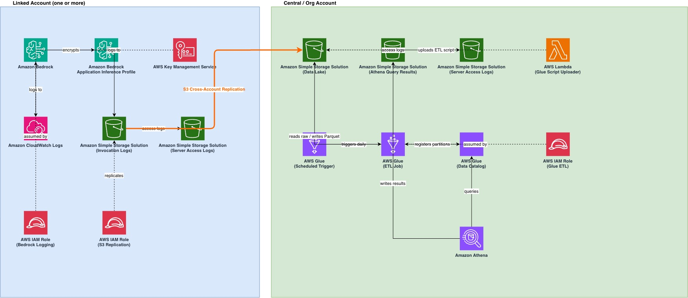

# Bedrock Token Cost Allocation

This sample shows how to attribute Amazon Bedrock token costs back to individual teams, projects, or business units using **Application Inference Profiles** and a centralized data lake.

**What it does:**

- Captures Bedrock model invocation logs (token counts, model IDs, prompts/responses) from one or more AWS accounts
- Replicates those logs to a central S3 data lake via cross-account S3 replication
- Runs a daily Glue ETL job that converts raw JSON.GZ logs to partitioned Parquet
- Lets you query invocation data in Athena, including a join to AWS CUR to get per-invocation dollar cost

---

## Architecture



**Cost attribution via Inference Profiles**

`bedrock-logging.yaml` also creates an [Application Inference Profile](https://docs.aws.amazon.com/bedrock/latest/userguide/inference-profiles-create.html) (`bedrock-observability-profile`) that wraps a foundation model. When your application invokes Bedrock through this profile, the profile ARN appears in both the invocation logs (`modelid` field) and in AWS Cost and Usage Report (CUR) line items (`line_item_resource_id`). This makes it possible to join logs to cost data — see [Athena Query Reference](./Bedrock%20Data%20Lake%20SQL.md).

---

## Prerequisites

- AWS CLI configured with credentials for each account
- CloudFormation `CAPABILITY_IAM` and `CAPABILITY_NAMED_IAM` permissions
- At least one linked account (the account that runs Bedrock workloads)
- One central/org account (receives replicated logs)
- Python 3 with `boto3` installed (`pip install boto3`) — required for the test script in Step 6
- (Optional) AWS CUR v2 enabled and exported to Athena if you want cost join queries

**Region constraint:** Both stacks must be deployed to **`us-east-1`**. The Application Inference Profile in `bedrock-logging.yaml` references the Amazon Nova Pro foundation model ARN, which is only available in `us-east-1`. Deploying to other regions will cause the `BedrockObservabilityProfile` resource to fail.

**Default parameter warning:** `bedrock-logging.yaml` has a hardcoded default value for `CentralDataLakeAccountId`. Always pass this parameter explicitly (as shown in Step 2) — never rely on the default.

---

## Deployment

> **Using Kiro or an AI assistant?** See [deploy.md](./deploy.md) — it includes an authentication setup guide (named profiles, SSO, or environment variables) and all commands with environment variables pre-wired. Kiro will ask how you want to authenticate before running any commands.

**This order matters** — the central account stack must exist before linked account stacks can reference it, and the bucket policy can only be applied after the linked account replication roles exist.

### Step 1 — Deploy the data lake to the central account

Deploy without the bucket policy first (the linked account replication roles don't exist yet — CloudFormation's `ResourceExistenceCheck` hook will reject the changeset if it references IAM role ARNs that don't exist):

```bash
aws cloudformation create-stack \
  --stack-name bedrock-data-lake \
  --template-body file://bedrock-data-lake.yaml \
  --capabilities CAPABILITY_IAM \
  --region us-east-1 \
  --profile <central-account-profile>

# Wait for the stack to finish before proceeding to Step 2
aws cloudformation wait stack-create-complete \
  --stack-name bedrock-data-lake \
  --region us-east-1 \
  --profile <central-account-profile>
```

> **Note:** `BedrockDataLakeBucketPolicy` is included in the template but the `SourceAccountReplicationRoleArns` parameter is required. At this stage, leave it out — once linked account stacks are deployed you will apply the bucket policy directly via the CLI (Step 4).

### Step 2 — Deploy the logging stack to each linked account

Pass the central account ID as `CentralDataLakeAccountId`. This creates the local S3 bucket, CloudWatch log group, IAM roles, and the Application Inference Profile.

```bash
CENTRAL_ACCOUNT_ID=<your-central-account-id>

# Repeat for each linked account
aws cloudformation create-stack \
  --stack-name bedrock-logging \
  --template-body file://bedrock-logging.yaml \
  --capabilities CAPABILITY_NAMED_IAM \
  --parameters ParameterKey=CentralDataLakeAccountId,ParameterValue=$CENTRAL_ACCOUNT_ID \
  --region us-east-1 \
  --profile <linked-account-profile>

# Wait for the stack to finish before proceeding to Step 3
aws cloudformation wait stack-create-complete \
  --stack-name bedrock-logging \
  --region us-east-1 \
  --profile <linked-account-profile>
```

### Step 3 — Retrieve the replication role ARNs

Run this in each linked account — you'll need these ARNs for Step 4:

```bash
aws cloudformation describe-stacks \
  --stack-name bedrock-logging \
  --query 'Stacks[0].Outputs[?OutputKey==`BedrockS3ReplicationRoleArn`].OutputValue' \
  --output text \
  --region us-east-1 \
  --profile <linked-account-profile>
```

Expected format: `arn:aws:iam::<linked-account-id>:role/bedrock-s3-replication-role`

Both stacks are now deployed. Continue to the **Manual Steps Required After Stack Deployment** section below.

---

## Manual Steps Required After Stack Deployment

> These two steps **cannot be automated via CloudFormation** and must be run manually after both stacks are deployed.

### Step 4 — Apply the data lake bucket policy (run in central account)

The bucket policy grants the linked account replication roles permission to write into the central S3 bucket. It must be applied via the CLI rather than CloudFormation — CFN stores the resolved IAM role ID at deploy time which can become stale if roles are recreated, causing silent `AccessDenied` on replication.

First collect the values you need:

```bash
# Central account ID
CENTRAL_ACCOUNT_ID=$(aws sts get-caller-identity \
  --query Account --output text \
  --profile <central-account-profile>)

# Replication role ARN(s) — run this in each linked account
REPLICATION_ROLE_ARN=$(aws cloudformation describe-stacks \
  --stack-name bedrock-logging \
  --query 'Stacks[0].Outputs[?OutputKey==`BedrockS3ReplicationRoleArn`].OutputValue' \
  --output text --region us-east-1 \
  --profile <linked-account-profile>)
```

Then apply the policy to the central account bucket:

```bash
aws s3api put-bucket-policy \
  --bucket bedrock-data-lake-${CENTRAL_ACCOUNT_ID} \
  --region us-east-1 \
  --profile <central-account-profile> \
  --policy "{
    \"Version\": \"2012-10-17\",
    \"Statement\": [
      {
        \"Sid\": \"DenyNonHTTPS\",
        \"Effect\": \"Deny\",
        \"Principal\": \"*\",
        \"Action\": \"s3:*\",
        \"Resource\": [
          \"arn:aws:s3:::bedrock-data-lake-${CENTRAL_ACCOUNT_ID}\",
          \"arn:aws:s3:::bedrock-data-lake-${CENTRAL_ACCOUNT_ID}/*\"
        ],
        \"Condition\": {\"Bool\": {\"aws:SecureTransport\": \"false\"}}
      },
      {
        \"Sid\": \"AllowCrossAccountReplication\",
        \"Effect\": \"Allow\",
        \"Principal\": {
          \"AWS\": [\"${REPLICATION_ROLE_ARN}\"]
        },
        \"Action\": [
          \"s3:ReplicateObject\",
          \"s3:ReplicateDelete\",
          \"s3:ReplicateTags\",
          \"s3:ObjectOwnerOverrideToBucketOwner\"
        ],
        \"Resource\": \"arn:aws:s3:::bedrock-data-lake-${CENTRAL_ACCOUNT_ID}/logs/*\"
      }
    ]
  }"
```

If you have multiple linked accounts, add each replication role ARN to the `AWS` array in `AllowCrossAccountReplication`.

### Step 5 — Enable Bedrock model invocation logging (run in each linked account)

This enables Bedrock to write invocation logs to both CloudWatch and S3. Run in each linked account:

```bash
LOGGING_ROLE_ARN=$(aws cloudformation describe-stacks \
  --stack-name bedrock-logging \
  --query 'Stacks[0].Outputs[?OutputKey==`BedrockLoggingRoleArn`].OutputValue' \
  --output text --region us-east-1 \
  --profile <linked-account-profile>)

LINKED_ACCOUNT_ID=$(aws sts get-caller-identity \
  --query Account --output text \
  --profile <linked-account-profile>)

aws bedrock put-model-invocation-logging-configuration \
  --logging-config "{
    \"cloudWatchConfig\": {
      \"logGroupName\": \"/aws/bedrock/modelinvocations\",
      \"roleArn\": \"$LOGGING_ROLE_ARN\"
    },
    \"s3Config\": {
      \"bucketName\": \"bedrock-logs-${LINKED_ACCOUNT_ID}-us-east-1\",
      \"keyPrefix\": \"${LINKED_ACCOUNT_ID}/\"
    },
    \"textDataDeliveryEnabled\": true,
    \"imageDataDeliveryEnabled\": true,
    \"embeddingDataDeliveryEnabled\": true
  }" \
  --region us-east-1 \
  --profile <linked-account-profile>
```

Verify logging is enabled:

```bash
aws bedrock get-model-invocation-logging-configuration \
  --region us-east-1 \
  --profile <linked-account-profile>
```

---

### Step 6 — Verify end-to-end

Once both manual steps above are complete:

1. Make a test Bedrock invocation in the linked account:

```bash
INFERENCE_PROFILE_ARN=$(aws cloudformation describe-stacks \
  --stack-name bedrock-logging \
  --query 'Stacks[0].Outputs[?OutputKey==`BedrockInferenceProfileArn`].OutputValue' \
  --output text --region us-east-1 \
  --profile <linked-account-profile>)

python scripts/test_bedrock_invocation.py \
  --profile <linked-account-profile> \
  --region us-east-1 \
  --stack-name bedrock-logging
```

2. Check logs appeared in the linked account source bucket (may take a few minutes):

```bash
aws s3 ls s3://bedrock-logs-${LINKED_ACCOUNT_ID}-us-east-1/AWSLogs/${LINKED_ACCOUNT_ID}/BedrockModelInvocationLogs/ \
  --recursive --profile <linked-account-profile>
```

3. Check replication arrived in the central account data lake:

```bash
aws s3 ls s3://bedrock-data-lake-${CENTRAL_ACCOUNT_ID}/${LINKED_ACCOUNT_ID}/AWSLogs/${LINKED_ACCOUNT_ID}/BedrockModelInvocationLogs/ \
  --recursive --profile <central-account-profile>
```

4. Run the Glue ETL job immediately (it normally runs daily at 05:30 UTC):

```bash
aws glue start-job-run \
  --job-name bedrock-logs-etl \
  --region us-east-1 \
  --profile <central-account-profile>
```

5. Create the Athena view (one-time step — this executes the saved query that was deployed with the stack):

```bash
# Get the named query ID deployed by CloudFormation
NAMED_QUERY_ID=$(aws athena list-named-queries \
  --work-group bedrock-analytics \
  --region us-east-1 \
  --profile <central-account-profile> \
  --query 'NamedQueryIds[0]' --output text)

# Get the SQL and execute it to create the view
QUERY=$(aws athena get-named-query \
  --named-query-id $NAMED_QUERY_ID \
  --region us-east-1 \
  --profile <central-account-profile> \
  --query 'NamedQuery.QueryString' --output text)

aws athena start-query-execution \
  --query-string "$QUERY" \
  --work-group bedrock-analytics \
  --region us-east-1 \
  --profile <central-account-profile>
```

Once complete, `bedrock_invocations_view` will appear in the Athena console under the `bedrock_logs` database. This only needs to be run once — after that you can query the view directly.

6. Query in Athena using the `bedrock-analytics` workgroup — see [Athena Query Reference](./Bedrock%20Data%20Lake%20SQL.md)

---

## Processed Table Schema

The ETL writes to `bedrock_logs.bedrock_invocations_processed` in Parquet format, partitioned by `account_id / year / month / day`.

| Column | Type | Description |
|--------|------|-------------|
| `schematype` | string | Always `ModelInvocationLog` |
| `schemaversion` | string | Log schema version (e.g. `1.0`) |
| `timestamp` | string | ISO 8601 invocation time |
| `region` | string | AWS region where the invocation occurred |
| `requestid` | string | Unique request ID |
| `operation` | string | API called — `Converse`, `InvokeModel`, etc. |
| `modelid` | string | Model ID or Application Inference Profile ARN used for the invocation |
| `identity_arn` | string | IAM principal ARN of the caller, e.g. `arn:aws:sts::123456789012:assumed-role/my-role/session` — use this to attribute usage to a team, service, or user |
| `requestmetadata` | map&lt;string,string&gt; | Optional key-value tags supplied by the caller via [per-request metadata](https://docs.aws.amazon.com/bedrock/latest/userguide/cost-mgmt-request-metadata.html) |
| `input` | struct | `inputbodyjson` (string), `inputcontenttype` (string), `inputtokencount` (int) |
| `output` | struct | `outputbodyjson` (string), `outputcontenttype` (string), `outputtokencount` (int) |
| `account_id` | string | **Partition key** — source AWS account ID |
| `year` | string | **Partition key** — e.g. `2026` |
| `month` | string | **Partition key** — e.g. `08` |
| `day` | string | **Partition key** — e.g. `07` |

**Always filter on partition columns** (`account_id`, `year`, `month`, `day`) in Athena to avoid full table scans.

---

## Querying Logs

All queries use the `bedrock-analytics` workgroup in the central account. The main table is `bedrock_logs.bedrock_invocations_processed`.

```sql
-- Invocations by account, identity, and model
SELECT account_id, identity_arn, modelid, COUNT(*) AS invocations,
       SUM(input.inputtokencount) AS total_input_tokens,
       SUM(output.outputtokencount) AS total_output_tokens
FROM bedrock_logs.bedrock_invocations_processed
WHERE year='2026' AND month='08'
GROUP BY account_id, identity_arn, modelid
ORDER BY invocations DESC;
```

For the full query reference including the CUR cost join, see [Bedrock Data Lake SQL.md](./Bedrock%20Data%20Lake%20SQL.md).

**Joining to CUR:** Bedrock invocations made through an Application Inference Profile use the profile ARN as the `modelid` in logs and as `line_item_resource_id` in CUR. Joining on these two fields plus a time window gives you per-invocation cost estimates. You can also join on `identity_arn` matched against `line_item_iam_principal` in CUR to attribute cost by IAM role and pull in any resource tags (`team`, `project`, etc.) applied to that role. See the SQL file for both join patterns.

---

## QuickSight Dashboard

A pre-built QuickSight dashboard (`Bedrock-Invocation-Usage-Dashboard.yaml`) is included in this repo. It visualises Bedrock invocation counts, token usage, and model breakdown using the `bedrock_invocations_view` Athena view as its dataset.

### Prerequisites

- Amazon QuickSight **Enterprise edition** activated in the central account
- Athena `bedrock_invocations_view` created (Step 5 above)
- `cid-cmd` Python tool installed

The `bedrock-data-lake` stack creates a `BedrockQuickSightDataSourceRole` IAM role with the necessary S3, Athena, and Glue permissions. When `cid-cmd` prompts you to choose a QuickSight role, select this role rather than creating a new one. Get the ARN from the stack output:

```bash
aws cloudformation describe-stacks \
  --stack-name bedrock-data-lake \
  --query 'Stacks[0].Outputs[?OutputKey==`QuickSightDataSourceRoleArn`].OutputValue' \
  --output text --region us-east-1 \
  --profile <central-account-profile>
```

### Install cid-cmd

```bash
pip3 install --upgrade cid-cmd
```

### Deploy the dashboard

Run from the repo root in the central account:

```bash
cid-cmd deploy --resources ./Bedrock-Invocation-Usage-Dashboard.yaml
```

`cid-cmd` will prompt you to select your Athena workgroup (`bedrock-analytics`) and QuickSight datasource, then deploy the dashboard and its dataset automatically.

### Refresh dataset

After new data is processed by the Glue ETL job, refresh the QuickSight SPICE dataset:

```bash
cid-cmd refresh --dashboard-id bedrock-invocation-usage-dashboard
```

### Update or delete

```bash
# Update dashboard and datasets
cid-cmd update --force --recursive

# Remove dashboard and all dependencies
cid-cmd delete --dashboard-id bedrock-invocation-usage-dashboard
```

---

**CloudFormation ResourceExistenceCheck on bucket policies**  
CloudFormation's early validation hook rejects bucket policies where referenced IAM principal ARNs don't yet exist. This is why the central account stack is deployed without the bucket policy first — deploy linked account stacks first, then apply the bucket policy via CLI (Step 4).

**Why the bucket policy must be applied via CLI**  
When CloudFormation resolves an IAM role ARN in a bucket policy principal, it stores the role's unique ID rather than the ARN. If the role was created after the initial stack deploy, or deleted and recreated, the stored ID becomes stale and replication fails silently with `AccessDenied`. The `put-bucket-policy` CLI call resolves ARNs to current role IDs at write time and avoids this issue.

**S3 replication only applies to new objects**  
Objects written before the replication rule was configured are not replicated. Invoke a new model request after all stacks are deployed to generate a fresh log entry.

**Replication requires both source role permissions AND destination bucket policy**  
Cross-account S3 replication needs:
1. The replication role in the source account can read the source bucket (handled by `BedrockS3ReplicationRole` in `bedrock-logging.yaml`)
2. The destination bucket policy explicitly allows the source replication role to write (Step 4 above)

Both are required — removing either will cause `AccessDenied` on replication.

**Glue CRAWL_NEW_FOLDERS_ONLY constraint**  
When `RecrawlBehavior: CRAWL_NEW_FOLDERS_ONLY`, Glue requires both `UpdateBehavior` and `DeleteBehavior` to be `LOG`. Setting `UpdateBehavior: UPDATE_IN_DATABASE` will fail with HTTP 400.

**MSCK REPAIR TABLE vs Glue Crawler**  
The ETL job calls `MSCK REPAIR TABLE` after writing Parquet to register new partitions in the Glue catalog. A Glue Crawler is not used. If you add data outside the ETL job (e.g., manual S3 uploads), run `MSCK REPAIR TABLE bedrock_logs.bedrock_invocations_processed` manually in Athena.

---

## Security

See [CONTRIBUTING](CONTRIBUTING.md#security-issue-notifications) for more information.

**Additional hardening recommendation:**  
The `AllowCrossAccountReplication` bucket policy statement grants access based on role ARNs. Consider adding a `PrincipalOrgID` condition to restrict access to principals inside your AWS Organization:

```json
"Condition": {
  "StringEquals": {
    "aws:PrincipalOrgID": "o-xxxxxxxxxx"
  }
}
```

This provides defense-in-depth so a mistyped or compromised role ARN from outside your organization cannot replicate data into the lake.

---

## License

This library is licensed under the MIT-0 License. See the LICENSE file.
