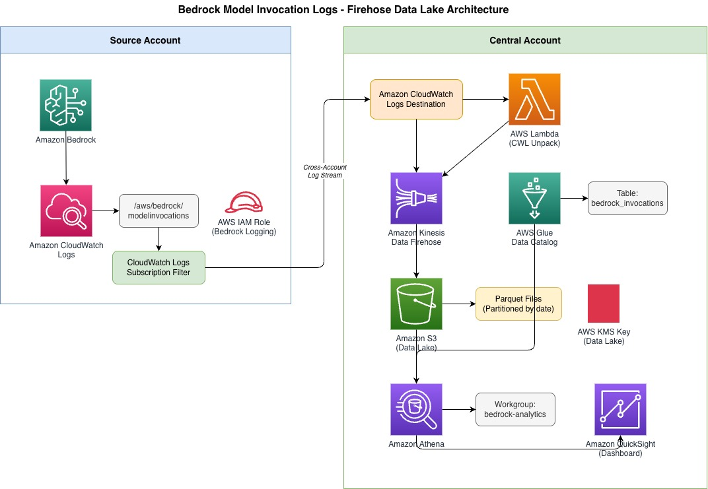

# Bedrock Token Cost Allocation

This sample shows how to attribute Amazon Bedrock token usage and estimated costs to teams, projects, applications, or business units using Bedrock model invocation logs and a centralized data lake.

> **Recommended architecture:** `bedrock-firehose-data-lake.yaml` uses CloudWatch Logs, a cross-account CloudWatch Logs destination, Kinesis Data Firehose, Lambda processing, S3 Parquet, Glue Data Catalog, Athena, and QuickSight. The older S3 replication pipeline is preserved for reference only.

## What it does

- Captures Bedrock model invocation logs from one or more source accounts.
- Delivers logs to a central account through CloudWatch Logs and Kinesis Data Firehose.
- Converts CloudWatch Logs envelopes and JSON events to Snappy-compressed Parquet.
- Stores the Parquet data in an encrypted central S3 data lake.
- Registers the data with Glue Data Catalog and exposes date partitions through Athena partition projection.
- Provides Athena queries and an optional QuickSight dashboard.
- Supports cost attribution by joining invocation usage with AWS CUR data.

## Architecture



```text
Source account(s)
  Bedrock → CloudWatch Logs → subscription filter
                                │
                                ▼
Central account
  CloudWatch Logs destination → Firehose DirectPut stream
                                → Lambda envelope unpacker
                                → JSON-to-Parquet conversion
                                → encrypted S3 data lake
                                → Glue Data Catalog
                                → Athena
                                → QuickSight SPICE dashboard

AWS CUR ───────────────────────► Athena cost-allocation queries
```

## Prerequisites

- AWS CLI configured with credentials for the central account and every source account.
- Permissions to create and update the CloudFormation, IAM, CloudWatch Logs, Firehose, Lambda, S3, Glue, Athena, KMS, and Bedrock logging resources used by the templates.
- At least one source account that runs Bedrock workloads.
- One central account that owns the Firehose stream, S3 data lake, Glue catalog, Athena workgroup, and optional QuickSight resources.
- Python 3 with `boto3` installed if you want to run `scripts/test_bedrock_invocation.py`.
- Optional: AWS CUR v2 exported to Athena for cost joins.
- Optional: QuickSight Enterprise edition for the dashboard.

Deploy all resources in **`us-east-1`**. The Bedrock logging configuration, Firehose stream, Athena workgroup, and QuickSight datasource must use the same Region.

The Firehose source template currently allows the source account specified in the `CWLFirehoseDestination` destination policy. Before deploying to a different account or multiple source accounts, update that policy in `bedrock-firehose-data-lake.yaml`; the `SourceAccountIds` parameter is declared for deployment compatibility but is not currently interpolated into the destination policy.

## Recommended Firehose deployment

Deploy the central account before the source accounts. No source-account S3 bucket, S3 replication role, manual replication bucket policy, Glue ETL job, Glue crawler, or `MSCK REPAIR TABLE` step is required for this architecture.

### Step 1 — Deploy the central Firehose data lake

Set the account profiles and IDs for your environment:

```bash
export CENTRAL_PROFILE=<central-account-profile>
export SOURCE_PROFILE=<source-account-profile>
export CENTRAL_ACCOUNT_ID=<central-account-id>
export SOURCE_ACCOUNT_ID=<source-account-id>
export AWS_REGION=us-east-1
```

The template declares `SourceAccountIds` as a required parameter. Pass the source account ID, and make sure the destination policy mentioned in the prerequisites authorizes the same account:

```bash
aws cloudformation create-stack \
  --stack-name bedrock-firehose-data-lake \
  --template-body file://bedrock-firehose-data-lake.yaml \
  --capabilities CAPABILITY_NAMED_IAM \
  --parameters ParameterKey=SourceAccountIds,ParameterValue=$SOURCE_ACCOUNT_ID \
  --region $AWS_REGION \
  --profile $CENTRAL_PROFILE

aws cloudformation wait stack-create-complete \
  --stack-name bedrock-firehose-data-lake \
  --region $AWS_REGION \
  --profile $CENTRAL_PROFILE
```

Retrieve the CloudWatch Logs destination ARN and the QuickSight role ARN from the stack outputs:

```bash
export CWL_DESTINATION_ARN=$(aws cloudformation describe-stacks \
  --stack-name bedrock-firehose-data-lake \
  --query 'Stacks[0].Outputs[?OutputKey==`CWLDestinationArn`].OutputValue' \
  --output text \
  --region $AWS_REGION \
  --profile $CENTRAL_PROFILE)

export QUICKSIGHT_ROLE_ARN=$(aws cloudformation describe-stacks \
  --stack-name bedrock-firehose-data-lake \
  --query 'Stacks[0].Outputs[?OutputKey==`QuickSightDataSourceRoleArn`].OutputValue' \
  --output text \
  --region $AWS_REGION \
  --profile $CENTRAL_PROFILE)

echo "$CWL_DESTINATION_ARN"
echo "$QUICKSIGHT_ROLE_ARN"
```

The central stack creates these important resources:

- `bedrock-invocations-v2`: Firehose DirectPut delivery stream.
- `bedrock-firehose-lake-<account-id>`: encrypted S3 data lake.
- `bedrock-cwl-unpack`: Lambda processor for CloudWatch Logs envelopes.
- `bedrock_logs.bedrock_invocations`: Glue table for Firehose Parquet data.
- `bedrock-analytics`: Athena workgroup.
- `bedrock-firehose-destination-v2`: cross-account CloudWatch Logs destination.
- `BedrockQuickSightDataSourceRole`: least-privilege QuickSight datasource role.

### Step 2 — Deploy the source-account logging stack

Repeat this step for every source account. The source template needs only the central CloudWatch Logs destination ARN:

```bash
aws cloudformation create-stack \
  --stack-name bedrock-logging \
  --template-body file://bedrock-logging.yaml \
  --capabilities CAPABILITY_NAMED_IAM \
  --parameters ParameterKey=CentralCWLDestinationArn,ParameterValue=$CWL_DESTINATION_ARN \
  --region $AWS_REGION \
  --profile $SOURCE_PROFILE

aws cloudformation wait stack-create-complete \
  --stack-name bedrock-logging \
  --region $AWS_REGION \
  --profile $SOURCE_PROFILE
```

This stack creates the source CloudWatch Logs group, the Bedrock logging role, and a subscription filter that forwards the log group to the central destination. It does not create a source S3 bucket.

### Step 3 — Enable Bedrock model invocation logging

Run this in each source account. The current Firehose architecture sends logs to CloudWatch only; do not add an `s3Config` block from the legacy replication deployment:

```bash
export LOGGING_ROLE_ARN=$(aws cloudformation describe-stacks \
  --stack-name bedrock-logging \
  --query 'Stacks[0].Outputs[?OutputKey==`BedrockLoggingRoleArn`].OutputValue' \
  --output text \
  --region $AWS_REGION \
  --profile $SOURCE_PROFILE)

aws bedrock put-model-invocation-logging-configuration \
  --logging-config "{
    \"cloudWatchConfig\": {
      \"logGroupName\": \"/aws/bedrock/modelinvocations\",
      \"roleArn\": \"$LOGGING_ROLE_ARN\"
    },
    \"textDataDeliveryEnabled\": true,
    \"imageDataDeliveryEnabled\": true,
    \"embeddingDataDeliveryEnabled\": true
  }" \
  --region $AWS_REGION \
  --profile $SOURCE_PROFILE

aws bedrock get-model-invocation-logging-configuration \
  --region $AWS_REGION \
  --profile $SOURCE_PROFILE
```

### Step 4 — Verify delivery to the central data lake

Run a test invocation in a source account:

```bash
python scripts/test_bedrock_invocation.py \
  --profile $SOURCE_PROFILE \
  --region $AWS_REGION \
  --stack-name bedrock-logging
```

Firehose buffers records until its size or time threshold is reached. Delivery normally takes about 60 seconds, but can take longer. Check the central S3 bucket for Parquet objects:

```bash
aws s3 ls "s3://bedrock-firehose-lake-${CENTRAL_ACCOUNT_ID}/data/" \
  --recursive \
  --profile $CENTRAL_PROFILE
```

If delivery fails, inspect the Firehose error prefix and the Firehose CloudWatch log group:

```bash
aws s3 ls "s3://bedrock-firehose-lake-${CENTRAL_ACCOUNT_ID}/errors/" \
  --recursive \
  --profile $CENTRAL_PROFILE
```

### Step 5 — Create the Athena view

The central stack creates a saved Athena query but does not execute it. Run the saved query once to create `bedrock_invocations_view`:

```bash
NAMED_QUERY_ID=$(aws athena list-named-queries \
  --work-group bedrock-analytics \
  --query 'NamedQueryIds[0]' \
  --output text \
  --region $AWS_REGION \
  --profile $CENTRAL_PROFILE)

QUERY=$(aws athena get-named-query \
  --named-query-id "$NAMED_QUERY_ID" \
  --query 'NamedQuery.QueryString' \
  --output text \
  --region $AWS_REGION \
  --profile $CENTRAL_PROFILE)

aws athena start-query-execution \
  --query-string "$QUERY" \
  --work-group bedrock-analytics \
  --region $AWS_REGION \
  --profile $CENTRAL_PROFILE
```

After the query succeeds, the view appears under the `bedrock_logs` database. The raw table is available immediately after Firehose delivers Parquet files; the view is a one-time schema convenience and must be recreated if it is deleted.

### Step 6 — Query the Firehose data

Use the `bedrock-analytics` workgroup:

```sql
SELECT accountid,
       modelid,
       COUNT(*) AS invocations,
       SUM(input.inputtokencount) AS total_input_tokens,
       SUM(output.outputtokencount) AS total_output_tokens
FROM bedrock_logs.bedrock_invocations
WHERE year = '2026'
  AND month = '08'
GROUP BY accountid, modelid
ORDER BY invocations DESC;
```

The flattened view exposes token usage, stop reason, prompt preview, and response preview:

```sql
SELECT accountid,
       modelid,
       identity,
       SUM(usage_input_tokens) AS total_input_tokens,
       SUM(usage_output_tokens) AS total_output_tokens,
       COUNT(*) AS invocations
FROM bedrock_logs.bedrock_invocations_view
WHERE year = '2026'
  AND month = '08'
GROUP BY accountid, modelid, identity
ORDER BY invocations DESC;
```

The Firehose table uses date-only partition projection with `year`, `month`, and `day`. `accountid` and `region` are regular Parquet columns, not S3 partition keys. Filter by date partitions in production queries to reduce Athena scan costs.

## QuickSight dashboard

The repository includes `Bedrock-Invocation-Usage-Dashboard.yaml`, which visualizes invocation counts, token usage, model breakdown, and identity attribution through the Athena view.

### QuickSight prerequisites

- QuickSight Enterprise edition activated in the central account.
- The `bedrock_invocations_view` Athena view created successfully.
- `cid-cmd` installed: `pip3 install --upgrade cid-cmd`.
- The QuickSight datasource uses the role output by the central Firehose stack:
  `arn:aws:iam::<central-account-id>:role/BedrockQuickSightDataSourceRole`.

The Firehose stack grants this role Athena, Glue, S3, and KMS permissions. The KMS permission is scoped to the Firehose data-lake key. The Athena workgroup enforces SSE-S3 for normal query results, so the role does not need the Athena-results KMS key for normal queries.

### Configure every Athena datasource used by the solution

QuickSight datasources are managed separately from CloudFormation. A datasource without `RoleArn` falls back to the account-level QuickSight service role, which can cause `s3:ListBucket` or `kms:Decrypt` errors. Verify each datasource used by the dashboard:

```bash
aws quicksight describe-data-source \
  --aws-account-id $CENTRAL_ACCOUNT_ID \
  --data-source-id <athena-datasource-id> \
  --query 'DataSource.DataSourceParameters.AthenaParameters' \
  --output json \
  --region $AWS_REGION \
  --profile $CENTRAL_PROFILE
```

The output must contain:

```json
{
  "WorkGroup": "bedrock-analytics",
  "RoleArn": "arn:aws:iam::<central-account-id>:role/BedrockQuickSightDataSourceRole"
}
```

For the standard datasource, configure `CID-CMD-Athena` after the central stack is deployed:

```bash
aws quicksight update-data-source \
  --aws-account-id $CENTRAL_ACCOUNT_ID \
  --data-source-id CID-CMD-Athena \
  --name CID-CMD-Athena \
  --data-source-parameters "{\"AthenaParameters\":{\"WorkGroup\":\"bedrock-analytics\",\"RoleArn\":\"$QUICKSIGHT_ROLE_ARN\"}}" \
  --region $AWS_REGION \
  --profile $CENTRAL_PROFILE
```

If a pre-existing datasource such as `CID-Data` is used by a dashboard, configure that datasource as well. Do not grant broad data-lake permissions to `aws-quicksight-service-role-v0` unless every QuickSight user and dashboard in the account should access this data lake.

### Deploy and refresh the dashboard

```bash
export AWS_PROFILE=$CENTRAL_PROFILE
export AWS_REGION=us-east-1

cid-cmd deploy --resources ./Bedrock-Invocation-Usage-Dashboard.yaml
cid-cmd refresh --dashboard-id bedrock-invocation-usage-dashboard
```

When prompted, use:

- Athena database: `bedrock_logs`
- Athena workgroup: `bedrock-analytics`
- QuickSight datasource: `CID-CMD-Athena`
- QuickSight role: `BedrockQuickSightDataSourceRole`

After new invocations reach the Firehose S3 data lake, refresh the SPICE dataset. If a refresh reports a principal named `aws-quicksight-service-role-v0`, inspect the dataset's datasource ARN and configure that datasource with the dedicated role.

To update the dashboard and dependencies:

```bash
cid-cmd update --force --recursive
```

## Data schema

The Firehose pipeline creates `bedrock_logs.bedrock_invocations` with these main fields:

- `schematype`, `schemaversion`, and `timestamp`
- `accountid`, `region`, `requestid`, `operation`, and `modelid`
- `identity_arn` and nested `requestmetadata`
- Nested `input` and `output` structures containing token counts and request/response content
- Date partition columns: `year`, `month`, and `day`

The flattened `bedrock_invocations_view` extracts input/output token usage, cache token counts, stop reason, prompt preview, and response preview. Prompt and response fields may contain sensitive data and should be protected accordingly.

## Querying and cost allocation

All queries should use the `bedrock-analytics` workgroup. See [Bedrock Data Lake SQL](./Bedrock%20Data%20Lake%20SQL.md) for query examples, including CUR joins.

Invocation logs provide usage and attribution data; they are not the official billing ledger. Cost allocation queries can join invocation data with AWS CUR using model ID, account, IAM identity, timestamps, and request metadata. The resulting values should be described as allocation or estimation results unless the query has been reconciled with the official bill.

## Firehose and S3 permissions

Firehose removes the need for cross-account S3 replication, but S3 remains the storage and query layer:

- `FirehoseRole` needs permission to write Parquet objects to the central data lake.
- `BedrockQuickSightDataSourceRole` needs permission to list and read data-lake objects for Athena and QuickSight.
- Athena and QuickSight need access to the Athena query-results location.
- The central data lake remains encrypted with a customer managed KMS key.

The Firehose architecture does not require source-account S3 buckets, replication roles, replication rules, a manual replication bucket policy, Glue ETL jobs, Glue crawlers, or `MSCK REPAIR TABLE`.

## Legacy S3 replication architecture

`bedrock-data-lake.yaml` contains the original S3 replication architecture. It uses source-account S3 buckets, cross-account replication, a central replication bucket, and Glue ETL processing. It is preserved for reference and should not be used for new Firehose deployments. The Firehose deployment steps above are authoritative for the recommended architecture.

## Security

- Source CloudWatch Logs are encrypted with a source-account KMS key.
- The central Firehose data lake is encrypted with a customer managed KMS key with rotation enabled.
- S3 public access is blocked and non-HTTPS access is denied.
- Firehose, CloudWatch Logs, Athena, Glue, Lambda, and QuickSight use separate least-privilege roles.
- The QuickSight datasource role is scoped to the central data lake and its KMS key.
- S3 buckets use retention policies so a stack update does not delete stored logs.
- The flattened view can expose prompt and response content; restrict access or remove those columns if the data is sensitive.

## License

This library is licensed under the MIT-0 License. See the LICENSE file.
